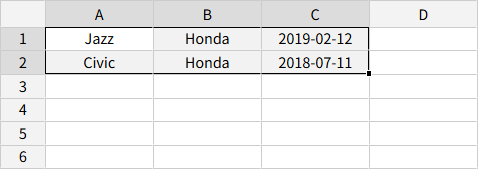
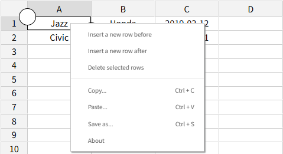
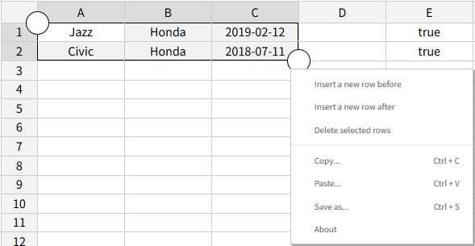
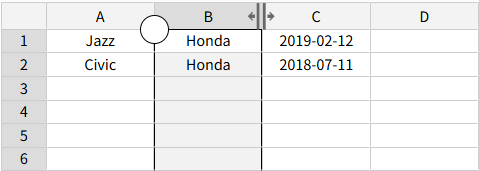
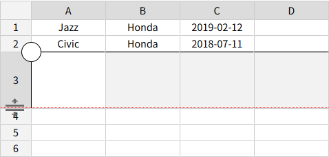

# JspreadsheetCE-touch-extension
## Overview
The JspreadsheetCE-touch-extension is a Javascript plugin designed to enhance the touch support for Jspreadsheet CE (Community Edition). This extension is crafted to provide intuitive and responsive touch interactions, making it ideal for mobile and tablet applications.

# Features
The following enhancements are made for touch interaction with Jspreadsheet CE:
* **Selectable Cell Range**: Allows users to select a range of cells using touch gestures.

  

  

* **Context Menu Display**: Allows users to show the context menu when cells are selected even on Mobile Safari. There are three ways to display the context menu:
  1. **Simple Context Menu Display**  
   When a cell is selected, the context menu is displayed.

     

  2. **Button-triggered Context Menu Display**  
   When a cell is selected, a button appears that allows the user to display the context menu.
  
     

     

  3. **Icon Panel Display**  
   When a cell is selected, an icon panel is displayed instead of the context menu.

     

* **Resize Column Width And Row Height**: Allows users to change column widths and row heights using touch gestures.

  

  

  

  

# System Requirements
This extension has been tested and is compatible with the following environments:
* Operating System: Windows 11 Pro 23H2
* Jspreadsheet CE Version: v.4.3.0
* Browsers:
  * Google Chrome: Version 135.0.7049.115 (Official Build) (64-bit)
  * Microsoft Edge: 136.0.3240.50 (64-bit)
  * Firefox: 128.9.0esr (64-bit)
  * Mobile Safari: 18.2.1

# Usage
Load the necessary files:
```html
<script src="./jspreadsheet_touch_extension.js"></script>
<link rel="stylesheet" href="./jspreadsheet_touch_extension.css" type="text/css" />
```
Call the setup method by specifying jspreadsheet as the first argument.
```html
touchExtension.setup(jspreadsheet(document.getElementById('spreadsheet'), {
  ...
}))
```

If you use an icon panel, include the Material Icons.
```html
<link rel="stylesheet" href="https://fonts.googleapis.com/css?family=Material+Icons" />
<link rel="stylesheet" href="https://fonts.googleapis.com/css2?family=Material+Symbols+Outlined:opsz,wght,FILL,GRAD@20..48,100..700,0..1,-50..200&icon_names=add_column_left" />
<link rel="stylesheet" href="https://fonts.googleapis.com/css2?family=Material+Symbols+Outlined:opsz,wght,FILL,GRAD@20..48,100..700,0..1,-50..200&icon_names=add_column_right" />
<link rel="stylesheet" href="https://fonts.googleapis.com/css2?family=Material+Symbols+Outlined:opsz,wght,FILL,GRAD@20..48,100..700,0..1,-50..200&icon_names=cell_merge" />
<link rel="stylesheet" href="https://fonts.googleapis.com/css2?family=Material+Symbols+Outlined:opsz,wght,FILL,GRAD@20..48,100..700,0..1,-50..200&icon_names=edit_square" />
<link rel="stylesheet" href="https://fonts.googleapis.com/css2?family=Material+Symbols+Outlined:opsz,wght,FILL,GRAD@20..48,100..700,0..1,-50..200&icon_names=sort" />
<link rel="stylesheet" href="https://fonts.googleapis.com/css2?family=Material+Symbols+Outlined:opsz,wght,FILL,GRAD@20..48,100..700,0..1,-50..200&icon_names=segment" />
<link rel="stylesheet" href="https://fonts.googleapis.com/css2?family=Material+Symbols+Outlined:opsz,wght,FILL,GRAD@20..48,100..700,0..1,-50..200&icon_names=add_row_above" />
<link rel="stylesheet" href="https://fonts.googleapis.com/css2?family=Material+Symbols+Outlined:opsz,wght,FILL,GRAD@20..48,100..700,0..1,-50..200&icon_names=add_row_below" />
<link rel="stylesheet" href="https://fonts.googleapis.com/css2?family=Material+Symbols+Outlined:opsz,wght,FILL,GRAD@20..48,100..700,0..1,-50..200&icon_names=variable_remove" />
```

# Options
Several options can be configured:
```javascript
<script src="./jspreadsheet_touch_extension.js"></script>
<script>
	touchExtension.setup(jspreadsheet(document.getElementById('spreadsheet'), {
	  ...
	}){
		contextMenuMode: 'icon',	// normal, expand, icon
		iconSize: 32,
		handleSize: 30,
		selectionHandleColor: 'white',
		selectionHandleBorder: 'black 1px solid',
	});
</script>
```

| Option | Description | Default Value |
|----------|-------------|------|
| contextMenuMode | How to display a context menu | 'normal, 'expand', 'icon'（default） |
| contextMenuShowDelay | The time it takes for the context menu to appear after selecting a cell | 500 (ms) |
| iconSize | Icon panel icon size | 32 (px) |
| handleSize | Size of the handles for selecting cells and for changing row height and column width | 30 (px) |
| selectionHandleColor | Cell selection handle color | white |
| selectionHandleBorder | Cell selection handle border | black 1px solid |
